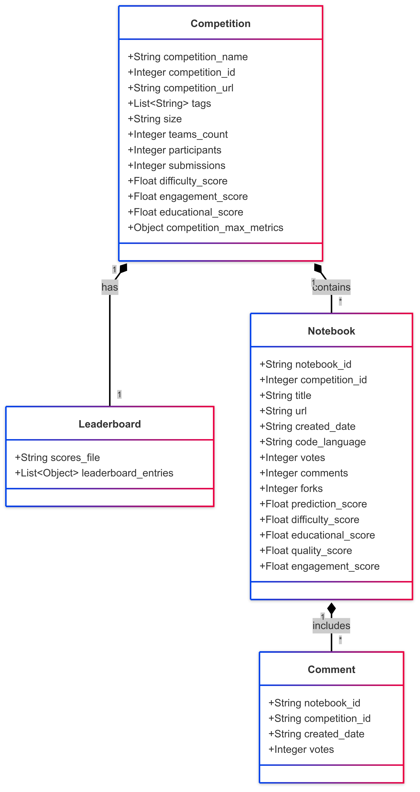
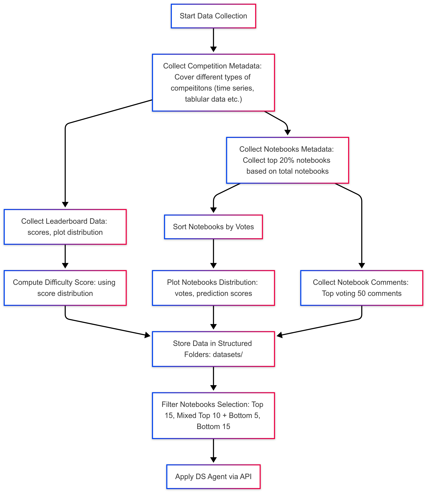

# Data Science DataSet Design
## Database Design High Level

## Data Collection Structure
```
kaggle-research-project/
│
├── datasets/
│   ├── competitions.json
│   └── {dataset_slug}/  # e.g., titanic/
│       ├── leaderboard/
│       │   └── scores.csv               # Columns: rank, team_id, score, date
│       │
│       └── notebooks/
│           ├── notebooks_metadata.json             # Columns: notebook_id, title, author, votes, score, url
│           └── code/
│               └── {notebook_id}/       # e.g., 123456/
│                   ├── comments_metadata.json
│                   ├── code.ipynb
│                   └── comments.json    # Top-voted comments with metadata
│
└── metadata_templates/
    ├── competitions.json            
    ├── notebooks_metadata.json            
    └── comments_metadata.json            
```

## Metadata Templates
### 1. competitions.json
```json
[
    {
        "competition_name": "titanic",
        "competition_id": 1,
        "competition_url": "https://www.kaggle.com/competitions/titanic",
        "code_list_url": "https://www.kaggle.com/competitions/titanic/code",
        "tag":["Binary Classification","Tabular","Begineer","Categorization Accuracy"], //we will scrap all tags related to the competition
        "size":"5G",
        "teams_count": 15734,
        "Participants":16016,
        "Submissions":60462,
        "Entrants":1362322,
        "difficulty_score":0.22,
        "engagement_score":0.3,
        "educationtion_score":0.4,
        "quality_score":3.5,
        "competition_max_metrics": {
            "max_votes": 500,
            "max_forks": 200,
            "max_comments": 80
        }
    }
]
```
### 2. notebooks_metadata.json
```json
[
    {
        "notebook_id": "nb-titanic-001",
        "compeittion_id":1,
        "title": "Titanic Survival Guide - XGBoost Starter",
        "url": "https://www.kaggle.com/code/kaggle_expert_123/titanic-survival-guide",
        "created_date": "2023-07-15",
        "code_language": "Python",
        "votes": 450, 
        "comments": 45, 
        "forks":5765, 
        "prediction_score": 0.812, 
        "difficulty_score": 0.35,
        "educational_score": 0.88,
        "quality_score": 4.2,
        "engagement_score": 0.787,
    }
]
```
### 3. comments_metadata.json
```json
[
    {
        "notebook_id": "nb-titanic-001",
        "competition_id": "titanic",
        "created_date": "2023-07-15",
        "votes": 450, 
    }
]
```

---
## 📊 Competition Metrics

### 1. Competition Difficulty Score
---
Measures how hard it was to achieve a high leaderboard score.

```math
\text{Difficulty} = \left(1 - \frac{\text{Average Score}}{\text{Max Score}}\right) \times \left(1 + \frac{\text{Standard Deviation of Scores}}{\text{Max Score}}\right)
```
Interpretation:

- Closer to 1 = Harder competition

- Example: Avg=0.6, σ=0.1, Max=1.0 → (1-0.6)×(1+0.1) = 0.44
- Low Average Score: Indicates participants struggled to achieve high results.

- Low Standard Deviation: Scores are tightly packed (hard to improve even slightly).

### 2. Community Engagement Score

The **Community Engagement Score** is defined as the number of shared notebooks per team.

```math
\text{NER} = \frac{\text{Notebooks}}{\text{Teams}}
```

*Example:*  
If there are 50 notebooks and 100 teams:

```math
\text{NER} = \frac{50}{100} = 0.5
```

### 3. Content Quality Score

The **Content Quality Score** reflects the average quality of shared content, with votes on notebooks.

```math
\text{CQI} = \frac{\text{Votes}_{\text{notebooks}}}{\text{Notebooks}}
```

*Example:*  
If there are 200 notebook votes and 50 comment votes across 100 teams:

```math
\text{CQI} = \frac{200 + 50}{100} = 2.5
```
### 4. Educational Value
---
Educational value gauges the learning potential of a competition, based on how participants share their work and engage with content.

Combine the Community Engagement Score and the Content Quality Score using weights:

```math
\text{Education} = \gamma \cdot \text{NER} + \delta \cdot \text{CQI}
```

*Example:*  
With \( \gamma = 0.4 \) and \( \delta = 0.6 \):

```math
\text{Education} = 0.4 \times 0.5 + 0.6 \times 2.5 = 0.2 + 1.5 = 1.7
```

Alternatively, we can express the educational value using a multiplicative model:

```math
\text{Education} = \left(\frac{\text{Notebooks}}{\text{Teams}}\right) \times \left(\frac{\text{Avg Votes}}{\text{Max Votes}}\right)
```

---
## 📊 Notebooks Metrics
### **Step 1: Collect Top 50 Notebook Metrics for the Competition**
First, gather data for **all notebooks** in the competition to compute relative maxima.  
For example, for the Titanic competition:
- Notebook A: Votes=500, Forks=200, Comments=80  
- Notebook B: Votes=300, Forks=150, Comments=50  
- Notebook C: Votes=100, Forks=50, Comments=20  

**Competition Maxima**:  
- `comp_max_votes = 500`  
- `comp_max_forks = 200`  
- `comp_max_comments = 80`  

---

### **Step 2: Normalize Metrics per Notebook**
For a target notebook (e.g., Votes=450, Forks=150, Comments=45):  
```python
vote_norm = 450 / comp_max_votes = 0.9  
fork_norm = 150 / comp_max_forks = 0.75  
comment_norm = 45 / comp_max_comments = 0.56  
predicition_score_norm = 0.6 / 1
```

---

### **Scores Formula (Using Relative Scaling)**

#### 1. **Engagement Score**  
```python
engagement_score = (0.3 * vote_norm) + (0.4 * fork_norm) + (0.3 * comment_norm)
```  


---

#### 2. **Quality Score**  
Rewards high votes, forks (indicates useful/reusable code) and scores:  
```python
quality_score = (vote_norm * 0.6) + (fork_norm * 0.3) + (predicition_score_norm * 0.2)
```  
---

#### 3. **Educational Score**  
Assumes educational notebooks get reused (forks) and discussed (comments):  
```python
educational_score = (fork_norm * 0.6) + (comment_norm * 0.4)
```  
---

#### 4. **Difficulty Score**  
**Cannot be derived from votes/forks/comments alone** – requires LLM analysis (see below).
Use this LLM prompt:


Analyze the Kaggle notebook at [URL] and score:
**Difficulty** (0-1): Technical complexity (e.g., advanced models, custom code).
Return JSON:
```
{
  "difficulty_score": 0.7,
  "educational_score": 0.8,
  "reasons": {
    "difficulty": "Uses TensorFlow Decision Forests with hyperparameter tuning...",
    "education": "Step-by-step explanations but lacks visualizations..."
  }
}
```

## Final Data Collection Flow
