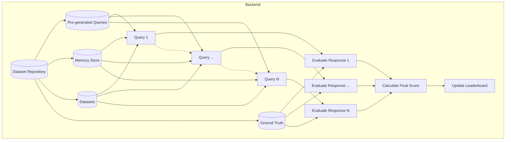

# Data Science Benchmark Arena

## Overview
We aim to benchmark the LLM-Agent's capabilities on data science tasks through a structured evaluation framework. This document provides a comprehensive design for implementing a system that evaluates LLM performance across various data science challenges.

## Main Goals
#### 1. We aim to test the LLM-Agent's capabilities of handling external side information in data science tasks.
- **External Side Information**: This refers to any additional context or data that can assist the LLM-Agent in completing a task. In the context of kaggle competitions, this include notebooks published by users that provide users' insights on how to approach the problem. 

### 2. We aim to test the LLM-Agent's capabilities of handling sequential tasks in data science.
- **Sequential Tasks**: This refers to a series of interconnected tasks that must be completed in a specific order. In the context of data science, this could involve data preprocessing, feature engineering, model training, and evaluation.

## System Architecture
The system follows a three-tier architecture:

1. **Datasets Module**: Repository of well-processed datasets
2. **Backend Module**: Core service handling benchmark logic and evaluation
3. **Frontend Module**: User interface for interaction and visualization

## Overall Process Flow

The overall process flow of the proposed benchmark flow is illustrated in the following diagram. The **main difference** between our proposed one and previous work is that our test framework is a **series of interconnected tasks** instead of a single task. For instance, in evaluating LLM-Agent's capabilities on dealing Titanic dataset, we will send a series of 10 queries (a snapshot of query structure is shown below), where each query will have the same instruction (i.e., predicting the survival of passengers) but **different side information**, namely the quality of notebooks. 

**Metrics:**
What we are measuring is the **progression margin** of the LLM-Agent's performance as the quality of side information changes, **instead of the absolute performance**. We hope to observe that as the quality of side information increases, the performance of LLM-Agent will only increase at initially and then stay the same. In other words, we hope to observe a very severe diminishing return of the performance as the quality of side information increases.




### Query Structure
Each query follows this structure:
```mermaid
classDiagram
    class Query {
        Query_id: UUID string
        Dataset
        Instruction
        Memory
        Response
    }
    
    class Dataset {
        name: local dataset identifier
        version: semver format
        split: test/val
    }
    
    class Instruction {
        task: classification, ranking, etc.
        description: detailed instructions
    }
    
    class Memory {
        memory_id: reference to local memory store
        content: optional additional context
        metadata: optional
    }
    
    class Response {
        format: json, text, binary
        schema: JSON schema
        max_tokens: optional
    }
    
    Query --> Dataset : "links to local dataset storage"
    Query --> Instruction
    Query --> Memory : "memory_id links to local memory base"
    Query --> Response
    
    class LocalDatasetStorage {
        dataset1
        dataset2
        datasetN
    }
    
    class LocalMemoryBase {
        memory1
        memory2
        memoryN
    }
    
    Dataset ..> LocalDatasetStorage : "references"
    Memory ..> LocalMemoryBase : "references via memory_id"
  ```
    
The MangoDb database structure is as follows:
```
AutoDataScience Repository
├───Datasets
│   ├───Kaggle
│       ├───Titanic ## User will use this ticker to refer to both the dataset and the side information
│       ├───HousePrices
│       ├───CreditCardFraud
│       ├───...
│   ├───Synthetic ## we DO NOT deal with this part

├───SideInformation/Memory
│   ├───Kaggle
│       ├───Titanic ## User will use this ticker to refer to both the dataset and the side information
│       ├───HousePrices
│       ├───CreditCardFraud
│       ├───...
│   ├───Synthetic ## we DO NOT deal with this part
```

## Interface Design

```python
class Query:
    """
    Represents a benchmarking task in the AgentDS-Bench platform.
    
    A query task contains the data, instructions, and metadata needed for an agent to complete
    a specific data science challenge.
    """
    
    def __init__(
        self, 
        task_id: str, 
        domain: str, 
        category: str, 
        data: Any, 
        instructions: str, 
        side_info: Optional[Any] = None, 
        response_format: Optional[Dict] = None
    ):
        """
        Initialize a new Task instance.
        
        Args:
            task_id: Unique identifier for the task
            domain: The domain or field this task belongs to
            category: The scaling category (Fidelity, Volume, Noise, Complexity)
            data: The primary data for the task
            instructions: Task instructions and requirements
            side_info: Additional information or context (optional)
            response_format: Expected format for the response (optional)
        """
        self.task_id = task_id
        self.domain = domain
        self.category = category
        self.data = data
        self.instructions = instructions
        self.side_info = side_info or {}
        self.response_format = response_format or {}
    
    def get_data(self) -> Any:
        """
        Get the primary data for this task.
        
        Returns:
            The task data
        """
        return self.data
    
    def get_instructions(self) -> str:
        """
        Get the instructions for this task.
        
        Returns:
            Task instructions as a string
        """
        return self.instructions
    
    def get_side_info(self) -> Any:
        """
        Get additional information or context for this task.
        
        Returns:
            Additional information
        """
        return self.side_info
    
    def get_response_format(self) -> Dict:
        """
        Get the expected format for the response.
        
        Returns:
            A dictionary describing the expected response format
        """
        return self.response_format
    
    def validate_response(self, response: Any) -> bool:
        """
        Validate that a response matches the expected format.
        
        Args:
            response: The response to validate
            
        Returns:
            True if the response is valid, False otherwise
        """
        # Basic validation - can be extended with more specific checks
        if not self.response_format:
            # If no format is specified, accept any response
            return True
            
        # If there is a response format, check that it matches the expected format
        # This is a simple implementation and should be extended based on the actual
        # response format specification
        try:
            if isinstance(self.response_format, dict) and isinstance(response, dict):
                # Check that all required keys are present
                for key in self.response_format:
                    if key not in response:
                        print(f"Missing required key in response: {key}")
                        return False
                return True
            else:
                # For non-dict formats, just check the type
                return isinstance(response, type(self.response_format))
        except Exception as e:
            print(f"Error validating response: {e}")
            return False 
```


